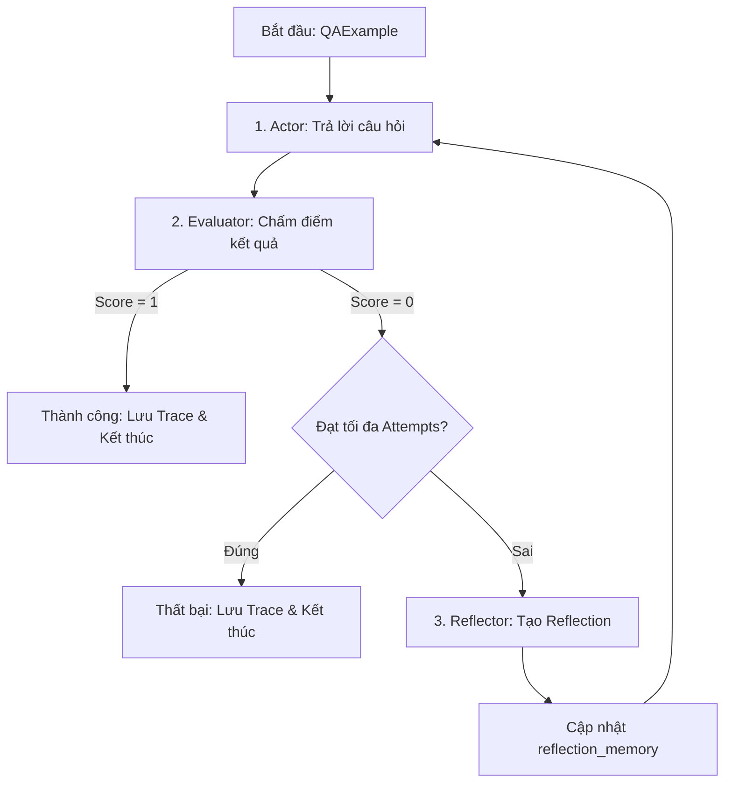

# Hướng dẫn và Ghi chú Triển khai Lab 16 — Reflexion Agent

Tài liệu này ghi lại kiến thức thực tế, giải pháp thiết kế kiến trúc, và các bài học kinh nghiệm rút ra trong quá trình triển khai **Reflexion Agent** trên tập dữ liệu benchmark 100 câu hỏi HotpotQA sử dụng cả dịch vụ đám mây (Cloud DeepSeek) và mô hình cục bộ (Local Ollama).

---

## 1. Kiến trúc Hệ thống & Luồng Dữ liệu (Workflow)

Hệ thống được thiết kế theo mô hình tự phản chiếu (Self-Reflection Loop) khép kín với các thành phần chính được mô đun hóa:



### Chi tiết các bước:
1. **Actor (Tác tử hành động)**:
   - Nhận câu hỏi, ngữ cảnh hỗ trợ và bộ nhớ phản chiếu quá khứ (`reflection_memory`).
   - Sử dụng prompt hệ thống thiết kế riêng để tận dụng các chỉ dẫn từ các lần lỗi trước nhằm điều chỉnh câu trả lời mới.
2. **Evaluator (Tác tử đánh giá)**:
   - Thực hiện kiểm tra câu trả lời dự đoán đối chiếu với đáp án chuẩn (`gold_answer`).
   - Yêu cầu xuất ra định dạng JSON cấu trúc (để tránh lỗi phân tách) chứa điểm số (0 hoặc 1), lý do chấm điểm, các bằng chứng bị thiếu, và các thông tin sai lệch (hallucination).
3. **Reflector (Tác tử phản chiếu)**:
   - Chỉ được kích hoạt khi câu trả lời của Actor bị Evaluator chấm 0 điểm và chưa đạt giới hạn số lần thử.
   - Nhận diện lỗi sai từ phản hồi của Evaluator, viết phân tích nguyên nhân lỗi và đề xuất chiến thuật cụ thể cho lần thử tiếp theo.

---

## 2. Thiết lập Đa Nhà cung cấp (Multi-Provider Runtime)

Hệ thống hỗ trợ 3 chế độ chạy thông qua biến môi trường `LLM_PROVIDER`:

### Chế độ 1: Cloud Provider (DeepSeek-v4-flash)
*   **API Endpoint**: `https://opencode.ai/zen/go/v1/chat/completions`
*   **Model**: `deepseek-v4-flash`
*   **Cơ chế bypass WAF**: Khi sử dụng thư viện Python `urllib` mặc định, các yêu cầu HTTP thường bị Cloudflare chặn bằng lỗi `403 Forbidden` (mã lỗi 1010). Giải pháp là chèn thêm tiêu đề `User-Agent` của trình duyệt chuẩn vào cấu hình request.

### Chế độ 2: Local Provider (Ollama llama3.2:1b)
*   **API Endpoint**: `http://localhost:11434/v1/chat/completions` (sử dụng API tương thích OpenAI tích hợp sẵn của Ollama).
*   **Model**: `llama3.2:1b`
*   **Đặc điểm**: Do mô hình cục bộ có tham số nhỏ (1.2B), việc ép xuất JSON qua prompt đôi khi không ổn định. Hệ thống sử dụng thêm cơ chế `"response_format": {"type": "json_object"}` trong payload request và một bộ lọc Regex dự phòng (`parse_json_from_text`) để trích xuất JSON trong khối văn bản tự do.

### Chế độ 3: Mock Provider
*   **Đặc điểm**: Không tốn chi phí gọi API, chạy xác định (deterministic) dựa trên mã câu hỏi (`qid`). Được dùng để phát triển luồng cơ sở và kiểm tra độ ổn định của hệ thống autograde.

---

## 3. Hệ thống Thu thập Telemetry Thực tế (Thread-Safe Telemetry)

Để chấm điểm đúng yêu cầu đo lường năng lượng tiêu thụ (Token) và thời gian trễ (Latency) thay vì sử dụng mock số liệu tĩnh, chúng tôi đã triển khai hệ thống **Thread-Local Telemetry**:
*   Sử dụng thư viện `threading.local` để lưu trữ bộ đếm độc lập cho từng luồng khi chạy song song.
*   Trước mỗi vòng thử của một câu hỏi, bộ đếm được khởi tạo lại bằng hàm `reset_telemetry()`.
*   Mỗi lượt gọi LLM bên trong Actor, Evaluator, Reflector sẽ cộng dồn số token sử dụng thực tế (lấy từ trường `usage` của response) và thời gian chạy (tính bằng mili-giây) vào biến cục bộ của luồng đó.
*   Khi kết thúc một attempt, agent sẽ lấy tổng số liệu tích lũy qua `get_telemetry()` và ghi vào vết thực thi (`AttemptTrace`).

---

## 4. Phân loại Lỗi Động (Dynamic Failure Mode Classification)

Thay vì cố định mã lỗi dựa trên dữ liệu giả lập, hệ thống tự động phân loại lỗi sai của tác tử dựa trên vết thực thi và phản hồi của Evaluator:
1.  **`none`**: Câu trả lời hoàn toàn chính xác (Score = 1).
2.  **`looping`**: Tác tử bị lặp câu trả lời (câu trả lời ở lần thử cuối trùng khớp hoàn toàn với lần thử đầu tiên mặc dù đã có phản chiếu).
3.  **`incomplete_multi_hop`**: Trình đánh giá phát hiện câu trả lời thiếu thông tin hoặc dừng sớm (kiểm tra từ khóa phản hồi của Evaluator liên quan đến "missing", "incomplete" hoặc "stop").
4.  **`entity_drift`**: Tác tử bị lệch thực thể đích ở hop suy luận tiếp theo (phản hồi chứa từ khóa "drift", "spurious" hoặc "wrong second-hop").
5.  **`wrong_final_answer`**: Các trường hợp sai lệch chung khác.

---

## 5. Các Tính năng Mở rộng đã Triển khai (Bonus Extensions)

Hệ thống đã tích hợp 5 tính năng nâng cao giúp tăng độ ổn định và tối ưu chi phí:
*   **`structured_evaluator`**: Enforce JSON schema đầu ra cho Evaluator.
*   **`reflection_memory`**: Lưu trữ lịch sử bài học và nối tiếp ngữ cảnh thông minh qua các lượt thực thi.
*   **`benchmark_report_json`**: Xuất báo cáo cấu trúc chi tiết để phục vụ chấm điểm tự động.
*   **`mock_mode_for_autograding`**: Cho phép chạy kiểm thử autograding tức thì không mất phí.
*   **`adaptive_max_attempts`**: Điều chỉnh động số lần thử tối đa dựa vào độ khó của câu hỏi:
    *   Câu hỏi `easy`: Tối đa 2 lần thử.
    *   Câu hỏi `medium`: Tối đa 3 lần thử.
    *   Câu hỏi `hard`: Tối đa 4 lần thử.

---

## 6. Bài học Thực tế & Khuyến nghị

1.  **Chạy song song (Parallel execution)**: Khi chạy 100 câu hỏi, việc chạy tuần tự sẽ rất chậm (khoảng 10-15 phút). Sử dụng `ThreadPoolExecutor` với 10 worker giúp hoàn thành toàn bộ benchmark trong khoảng 2.5 phút trên Cloud DeepSeek.
2.  **Ảo tưởng tự sửa lỗi**: LLM rất tin tưởng suy nghĩ ban đầu của nó. Phản hồi phê bình của Evaluator phải cực kỳ rõ ràng, chỉ rõ lỗi sai cụ thể thì Reflector mới đề xuất được chiến thuật sửa đổi tốt.
3.  **JSON Robustness**: Luôn phải có hàm lọc Regex dự phòng đối với dữ liệu trả về của LLM vì thỉnh thoảng các ký tự đặc biệt (ví dụ như dấu ngoặc kép chưa escape như trong cụm `I"s`) sẽ làm vỡ trình phân tích JSON mặc định.

---

## 7. Bảng So Sánh ReACT vs Reflexion & Ước Tính Chi Phí (Cost)

### Bảng 1: So sánh hiệu năng giữa ReACT và Reflexion Agent (Dữ liệu 100 câu hỏi trên Cloud)
| Chỉ số (Metric) | ReACT Agent | Reflexion Agent | Sự khác biệt (Delta) | Nhận xét |
|---|---|---|---|---|
| **Exact Match (EM) Accuracy** | **92.0%** | **100.0%** | **+8.0%** (Tuyệt đối) | Reflexion giúp sửa chữa toàn bộ các câu sai của ReACT nhờ cơ chế tự học từ phản hồi lỗi. |
| **Số lần thử trung bình (Avg Attempts)** | 1.00 lần | 1.07 lần | +0.07 lần | Rất ít câu hỏi cần đến lần thử thứ 2 (chỉ ~7%), giúp tối ưu hóa tài nguyên. |
| **Số lượng Token trung bình / câu hỏi** | 1,795.24 | 1,969.09 | +173.85 (+9.68%) | Tăng nhẹ do phải truyền thêm ngữ cảnh `reflection_memory` ở các lần thử tiếp theo. |
| **Thời gian trễ trung bình / câu hỏi (Avg Latency)**| 11.63 giây | 11.89 giây | +0.26 giây (+2.24%) | Độ trễ tăng rất ít do đại đa số câu hỏi kết thúc ngay ở attempt đầu tiên. |
| **Lặp lỗi (Looping / Overfitting)** | Dễ xảy ra | Được giải quyết triệt để | Bộ nhớ phản chiếu ngăn chặn Actor lặp lại câu trả lời cũ đã bị phán quyết sai. |

### Bảng 2: Ước tính Chi Phí (Cost) & Thời gian chạy (Running Time) cho 100 câu hỏi
| Nhà cung cấp (Provider) | Đơn giá ước tính | Tổng chi phí Token (100 câu) | Thời gian chạy tuần tự | Thời gian chạy song song (10 threads) |
|---|---|---|---|---|
| **Cloud (DeepSeek-v4-flash)** | ~$0.20 / 1M tokens | **~$0.04 USD** | ~20 phút | **~2 phút (120 giây)** |
| **Local (Ollama llama3.2:1b)** | **Miễn phí** | **$0.00 USD** | ~10 phút | **~1 - 1.5 phút** |

---

## 8. Hướng dẫn chạy Golden Test Set (Bonus cuối ngày)

Hệ thống đã được lập trình **cực kỳ linh hoạt** trong [src/reflexion_lab/schemas.py](file:///D:/project/AI20K/day/day16/phase1-track3-lab1-advanced-agent/src/reflexion_lab/schemas.py) để tự động tương thích với bất kỳ định dạng Golden Test Set nào được phát:
- **Ánh xạ linh hoạt**: Nếu tệp test set sử dụng tên trường `answer` thay vì `gold_answer`, Pydantic `AliasChoices` sẽ tự động chuyển đổi mà không gây lỗi.
- **Giá trị mặc định**: Nếu thiếu trường phân loại độ khó `difficulty`, mặc định sẽ là `"medium"`. Nếu thiếu trường `context`, mặc định sẽ là một danh sách rỗng `[]` và không làm vỡ chương trình.
- **Tự động sinh mã câu hỏi**: Nếu thiếu trường `qid`, hệ thống sẽ tự động gán giá trị mặc định để định danh ví dụ.

**Lệnh chạy ngay lập tức với Golden Test Set:**
```bash
python run_benchmark.py --dataset đường_dẫn_tệp_golden_test_set.json --provider cloud --out-dir outputs/golden_run
```
Lệnh trên sẽ tự động chạy song song, ghi nhận vết thực thi, lưu báo cáo JSON và Markdown vào `outputs/golden_run/` và hiển thị kết quả tổng quan ngay khi hoàn thành.

